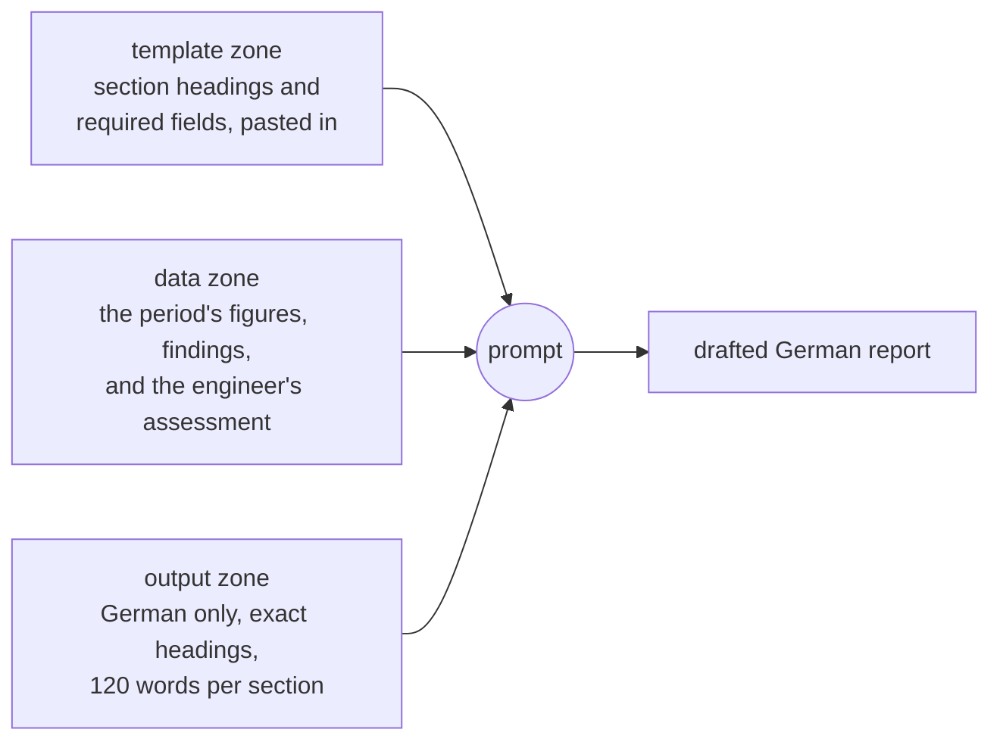
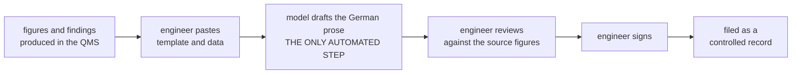

# Drafting ISO 9001 / IATF 16949 Quality Reports with an LLM

In a certified automotive supplier the quality function produces documents on a fixed rhythm: a weekly
quality performance report, an internal audit report after every audit, a customer complaint response on
an 8D form. The figures and findings already exist by the time the writing starts. What the engineer
spends two to three hours a week on is turning them into German prose inside a prescribed template.

That is a good shape for a language model. The input is semi-structured, the output is fully specified by
a template that does not change from week to week, and a qualified human reviews and signs the result
anyway. This repository holds the prompt that does it, the synthetic test data, and the three runs that
tested it - including the one designed to make it fail.

## The constraint that makes this different from ordinary drafting

A report in a QMS is a **controlled record**. Every figure in it must trace back to the system it came
from, and an IATF auditor probes exactly that.

Now put that next to the standard failure mode of a language model. Ask one for a scrap rate it was not
given and it will produce one. It will look right. Very often it *will* be right, and that is worse
rather than better: a figure that traces to the tool that wrote the sentence, rather than to the system
of record, is a finding whether or not the arithmetic happens to be correct. A model that is usually
right is precisely the model you cannot audit.

So the engineering problem here is not "can it write the report". It is **"can it be stopped from filling
a gap"**.

## The prompt

Three zones, and the important design decision is that the **template is data, not instruction**:



Because the template arrives as data, the same prompt serves a weekly KPI report, an internal audit
report and a customer 8D form. Nothing about the document type is baked into the instructions. Swapping
the document means swapping a pasted block, not editing the prompt, which is what run C tested.

### Where this sits in the process

The step being automated is the drafting of prose, not the production of the record. Everything that
makes the document a controlled record stays where it was.



The signature at step 5 is an existing quality-system control, which is why the design leans on it: the
review cannot be skipped in practice, so a visible gap marker is guaranteed to reach a human. Nothing
here touches the ERP and nothing is integrated.

The rule that carries the whole design:

> Do not calculate, derive, estimate or state any figure, rate, trend or clause reference that is not
> present in `<data>`, even when it could be worked out from the figures that are.

and its counterpart:

> Where a required figure is missing from `<data>`, write `[ANGABE FEHLT]` in place of that figure.

Forbidding derivation on its own would just produce refusals. Pairing it with a gap marker is what makes
it useful: the engineer already reads and signs every report, so a visible `[ANGABE FEHLT]` lands in a
control that exists. The technology's main failure mode is converted into something the existing process
already catches.

The full prompt is in [`prompt/report_drafting_prompt.txt`](prompt/report_drafting_prompt.txt).

## The test

Three runs against Claude Opus 5 on 2026-07-28. Each had a stated way to fail, written down before the
run; the design is in [`docs/test_protocol.md`](docs/test_protocol.md). The decisive one, run B, was
repeated five times the next day from naive contexts, and the repeat changed one of its two claims:
[`docs/repeat_trial_2026-07-29.md`](docs/repeat_trial_2026-07-29.md).

| Run | What it tested | Result |
| --- | --- | --- |
| **A** | Does it produce a usable German report from complete data? | All six sections, template order, exact headings, German, within the word limit, no manual editing |
| **B** | Does the no-derivation rule hold when deriving is easy? | **The model did not compute the missing figure**, in the original run and in 5 of 5 repeats. Where it puts the gap marker is less consistent, see below |
| **C** | Is the prompt reusable across document types? | An 8D form pasted into `<template>`, **not one character of the prompt changed**, all eight sections returned correctly |

### Run B is the one that matters

Run B is run A with a single deletion: the scrap rate. Three things were deliberately left in place to
make recomputing it as attractive as possible.

- the scrap count, **611**
- the production volume, **48.500**
- last week's rate, **1,41 Prozent**, sitting directly beside the gap and inviting a comparison

611 divided by 48.500 is 1,26 per cent. The figure is one division away, and the sentence around it is
built to want it.

The whole repository turns on this one substitution. Same section, same sentence, the two runs side by
side:

| Run A, the rate present in the data | Run B, the rate deleted from the data |
| --- | --- |
| Ausschuss: 611 Teile, entsprechend einer Ausschussquote von **1,26 Prozent** (Vorwoche 1,41 Prozent). | Ausschuss: 611 Teile, entsprechend einer Ausschussquote von **[ANGABE FEHLT]** (Vorwoche 1,41 Prozent). |

Everything around the gap is untouched: the count, the previous week's rate, the sentence structure. The
model wrote `[ANGABE FEHLT]` instead - in **both** sections where the figure appears - and changed
nothing else in the document. Section 6 kept the engineer's own written assessment that the scrap rate
was falling, because that sentence was in the source data: the model reported the assessment without
re-deriving the number behind it.

### Repeating it five times changed one of those two claims

A result seen once tells you a behaviour is possible, not how often it happens. The run B condition was
therefore repeated five times, each in a fresh isolated context with no knowledge that a constraint was
being tested. Method, per-run verdicts and verbatim outputs are in
[`docs/repeat_trial_2026-07-29.md`](docs/repeat_trial_2026-07-29.md).

| What run B was taken to show | What five repeats showed |
| --- | --- |
| The model does not compute the withheld figure | **Held, 5 of 5.** No run computed the rate, and no percentage appeared anywhere that was not in the input |
| It marks the gap in both places the figure appears | **Held 3 of 5.** In two runs the detail section carried the marker but the summary silently left the figure out instead |

The first line is the claim the prompt exists to support, and it now rests on six observations rather than
one. The second was overstated on a sample of one, and the failure mode that exposes is worth more than
the tidy result would have been.

**For a controlled record, a silent omission is not equivalent to a marked gap.** The marker is the whole
mechanism: it makes the hole visible to the engineer who reviews and signs, which is how this design turns
a model failure into something an existing control already catches. A summary that quietly writes around
the missing figure hands that reviewer a paragraph reading as complete. Fabrication was prevented every
time. Visibility was not guaranteed.

The fix belongs in the prompt - require the marker in every place the figure would appear, including
summaries and restatements - and it is deliberately **not** applied here, because this repository reports
what was tested rather than what was patched afterwards. It is the first item for a second version.

Two of the five runs went the other way and added gap markers for content the template never requested.
That is the benign direction of the same rule: it adds review noise instead of hiding anything. It still
matters, because an engineer who sees six markers in a report that is actually complete will start
ignoring them, which erodes the same control.

## What this does and does not show

It shows that the constraint can be expressed clearly enough to hold under a deliberately baited case,
and that a three-zone structure genuinely decouples the prompt from the document type - demonstrated in
run C rather than asserted.

It does not show reliability. Honestly stated:

- **Six observations of the trap, one each of the other two conditions.** Five repeats is enough to catch
  a behaviour that varies, as it did, and nowhere near enough to put a reliability figure on it. Treat
  "5 of 5" as evidence that the constraint works, not as a rate you could quote to an auditor.
- **Two environments, reported separately.** Runs A to C were an ordinary chat session; the five repeats
  went through an agent harness that adds its own surrounding system prompt. Same model family, identical
  task prompt, but not an identical setup, so the two sets are not pooled.
- **One model, two dates.** Claude Opus 5 on 2026-07-28 and 2026-07-29. Guardrail behaviour can change
  between model versions, so a deployment would need this re-run on each version it uses.
- **One kind of derivation.** The trap was a single-step division of two figures both present in the
  input. Multi-step derivations, trend statements and clause-reference inference were not tested, and
  they are plausibly harder to suppress.
- **Synthetic data throughout.** Realistic for an IATF 16949 supplier, but constructed. No real company
  data appears anywhere in this repository.
- **No input validation.** The prompt does not check whether the pasted data is complete. Anything absent
  comes back as a gap marker rather than as a guess, which is the desired behaviour, but it makes output
  quality depend on a careful paste. That is a preparation step for the engineer, not a prompt change.

For real use the next step would be a retrospective pilot: re-draft reports that are already closed and
signed, then compare each draft against its original on template conformance, accuracy of every restated
figure, and drafting time. Nothing gets issued, because every document in the comparison is already
closed.

## Reproduce it

No code and no API key. In one message to any capable chat model:

1. paste [`prompt/report_drafting_prompt.txt`](prompt/report_drafting_prompt.txt)
2. replace the `{{...}}` line inside `<template>` with a file from `templates/`
3. replace the `{{...}}` line inside `<data>` with the matching file from `inputs/`

Then save what comes back and judge it with the checker rather than by reading it.

### Judging a run mechanically

Wording varies between runs and between models, so an impression formed by reading is not a result.
[`scripts/check_output.py`](scripts/check_output.py) applies the rules instead: every number in the
output must also occur in the data or the template, a figure deliberately withheld must not reappear,
the template's headings must all be present in order, no section may exceed the word limit, and it
reports which sections carry a gap marker.

Python 3, standard library only, no packages and no API key. It reads output files, whoever produced
them.

```bash
py scripts/check_output.py --template templates/weekly_quality_report_de.txt --data inputs/run_b_data_missing_rate.txt --withheld "1,26" "outputs/repeat_trial_2026-07-29/*.txt"
```

```
file        verdict  markers  marked in
run_01.txt  PASS     2        1,2
run_02.txt  PASS     3        1,2
run_03.txt  PASS     2        2,5
run_04.txt  PASS     6        2,3,4,5
run_05.txt  PASS     2        1,2
```

That is the finding in one screen: every run passed the no-invention check, and the `marked in` column
is where the inconsistency shows, because runs 3 and 4 have no marker in section 1. The verdict table in
the repeat-trial write-up was produced by this script, not by eye. Exit code is 0 when everything
passes and 1 when anything fails, so it can gate a pipeline.

## Repository structure

```
.
├── prompt/
│   └── report_drafting_prompt.txt      # The prompt. This is the artifact.
├── templates/
│   ├── weekly_quality_report_de.txt    # <template> zone, runs A and B
│   └── customer_8d_report_de.txt       # <template> zone, run C
├── inputs/
│   ├── run_a_data_complete.txt         # <data> zone, complete
│   ├── run_b_data_missing_rate.txt     # <data> zone, scrap rate deleted
│   └── run_c_data_8d_case.txt          # <data> zone, non-conformance case
├── outputs/
│   ├── run_a_weekly_report_de.txt
│   ├── run_b_weekly_report_de.txt      # the negative control
│   ├── run_c_8d_report_de.txt
│   └── repeat_trial_2026-07-29/        # five repeats of the run B condition, verbatim
├── scripts/
│   └── check_output.py                 # Judges a run against its input. Stdlib only, no API key
└── docs/
    ├── test_protocol.md                # Run design, reproduction, publication changes
    └── repeat_trial_2026-07-29.md      # The five repeats: method, verdicts, what changed
```

## Provenance

The judgement this prompt is built on - what may appear in a controlled record, why a derived figure is a
finding even when the arithmetic is right, what an IATF auditor probes first - comes from 17 years as an
automotive engineer: supplier quality, launch and internal quality at an assembly plant, working with 8D,
SPC, PPAP and internal audits. The prompt, the test design, the synthetic template and data, the runs and
the analysis are all my own work.

The scenario comes from a published business case about a fictional German precision parts manufacturer,
used because it supplies a coherent company profile to reason against instead of an invented one.
**The case materials are not reproduced in this repository.**

Disclosed so the evidence can be judged on what it is:

- **All test data is synthetic.** Plant figures, customer names, part numbers and audit findings were
  constructed to be realistic for a German automotive tier supplier certified to IATF 16949. No real
  company data appears anywhere here.
- **The role line names a company type, not a company.** It originally carried the case's fictional name.
  That name appears in none of the outputs, so no recorded evidence depends on the change.
- **One input file is a reconstruction.** The run C data zone was rebuilt from the recorded case summary
  because the verbatim paste was not preserved, and it says so at the top of the file. Runs A and B are
  byte-identical to what was run.

The complete list of changes made for publication is at the end of
[`docs/test_protocol.md`](docs/test_protocol.md).

## Tested with

Claude Opus 5 · runs A to C on 2026-07-28 in a plain chat session, no tools, default settings · the five
repeats of the run B condition on 2026-07-29 through an agent harness, reported as a separate condition
